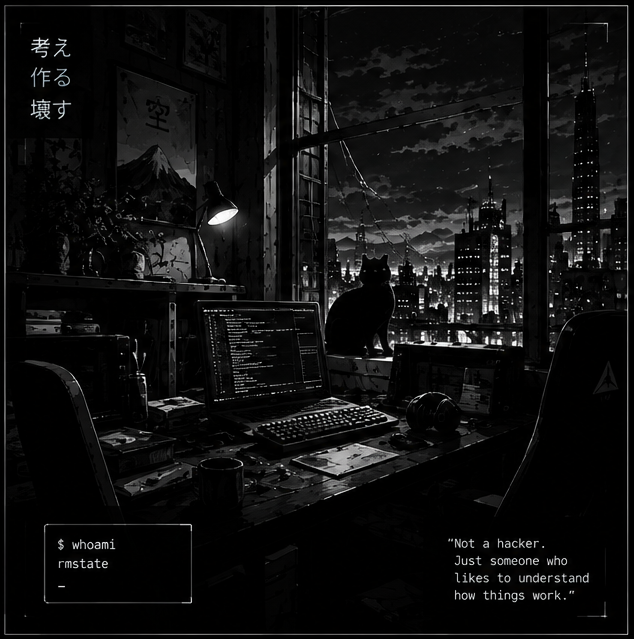

 <div align="center">


<br/>

# `rmstate_`

**LINUX / NETWORKING / SECURITY ENGINEERING**

*Breaking binaries. Tracing packets. Fixing systems.*

[](https://github.com/rmstate)
[](https://github.com/rmstate)
[](https://github.com/rmstate)

</div>

---

## `// about_me`

<table>
<tr>
<td width="58%" valign="top">

```text
$ whoami
rmstate

$ uname -o
GNU/Linux

$ cat /etc/motd
Linux enthusiast.
Network troubleshooter.
Security engineer in progress.

$ _
```

I enjoy figuring out why systems fail — from Linux services and routing to security tooling and network traffic.

* **Systems:** Linux, Docker, Bash
* **Networking:** routing, packet analysis, troubleshooting
* **Security:** security tooling, reverse engineering
* **Method:** reproduce, investigate, verify

</td>
<td width="42%" valign="top">



</td>
</tr>
</table>

---

## `// currently_building`

### `vipnet-docker`

A hands-on investigation into running a VPN client inside Docker, with a focus on Linux routing, tunnel interfaces, NAT, and packet-level diagnostics.

```text
STATUS   : EXPERIMENTAL
FOCUS    : DOCKER / LINUX NETWORKING
APPROACH : TRACE FIRST, GUESS NEVER
```

> The goal is to document the setup, the failures, the evidence, and the verified results — without publishing proprietary client packages or private keys.

---

## `// selected_work`

Projects will be featured here as they become ready for public release.

No fake demos. No mystery claims. Just reproducible work and technical notes.

---

## `// philosophy`

<div align="center">


<br/>

> **Don't guess. Trace the packets. Read the logs. Verify the fix.**

`rmstate@arch:~$` — Better tools. Better understanding.

</div>
