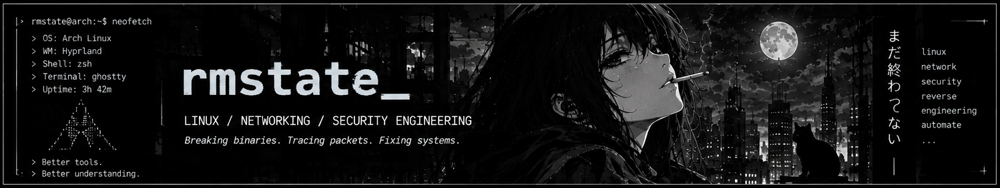

 <div align="center">



<br/>

# `rmstate_`

**LINUX · NETWORKING · SECURITY · REVERSE ENGINEERING**

*Investigate. Disassemble. Trace. Understand.*

[](https://github.com/rmstate)
[](https://github.com/rmstate)
[](https://github.com/rmstate)
[](https://github.com/rmstate)

</div>

---

## `// system`

```text
┌─ rmstate@arch ──────────────────────┐
│  OS          GNU/Linux               │
│  SYSTEMS     Linux · Docker          │
│  NETWORK     Routing · VPN · NAT     │
│  SECURITY    Investigation           │
│  REVERSE     Binary analysis         │
└─────────────────────────────────────┘
```

---

## `// about_me`

I explore how systems and software behave under the hood — from tracing network traffic and troubleshooting Linux infrastructure to investigating executable files and understanding program behavior.

* **Systems** — Linux, Docker, Bash, troubleshooting
* **Networking** — routing, tunnels, NAT, packet analysis
* **Security** — security tooling and investigation
* **Reverse engineering** — binary structure, disassembly, static and dynamic analysis

---

## `// selected_work`

### `vipnet-docker`

**Docker / VPN / Linux networking**

A practical project investigating VPN client behavior inside Docker and tracing traffic between the host, container, and tunnel.

```text
SCOPE     Docker networking
FOCUS     Routes / tunnels / NAT
METHOD    Packet-level diagnostics
```

* Inspecting interfaces and routing tables
* Tracing traffic through VPN tunnels
* Investigating forwarding and NAT
* Reproducing connectivity failures and verifying fixes

[**View repository →**](https://github.com/rmstate/vipnet-docker)

---

## `// reverse_engineering`

**Understand the binary. Reconstruct the behavior.**

Exploring how compiled software is structured, how programs interact with the operating system, and how to derive conclusions from observable evidence.

* **Static analysis** — executable structure, strings, imports, disassembly
* **Dynamic analysis** — runtime behavior, processes, files, system calls
* **Binary formats** — executable internals and program layout
* **Behavioral analysis** — connecting observed activity with program logic
* **Malware analysis** — investigating suspicious files in controlled environments

---

## `// interests`

* Linux internals and operating system behavior
* Network routing, tunnels, and packet analysis
* Reverse engineering and executable analysis
* Security research and diagnostic tooling

---

## `// activity`

<div align="center">

[**View GitHub profile and contribution activity →**](https://github.com/rmstate)

[**Explore repositories →**](https://github.com/rmstate?tab=repositories)

</div>

---

<div align="center">


<br/>

> **Don't guess. Trace the packets. Read the logs. Understand the binary.**

`rmstate@arch:~$`

</div>
